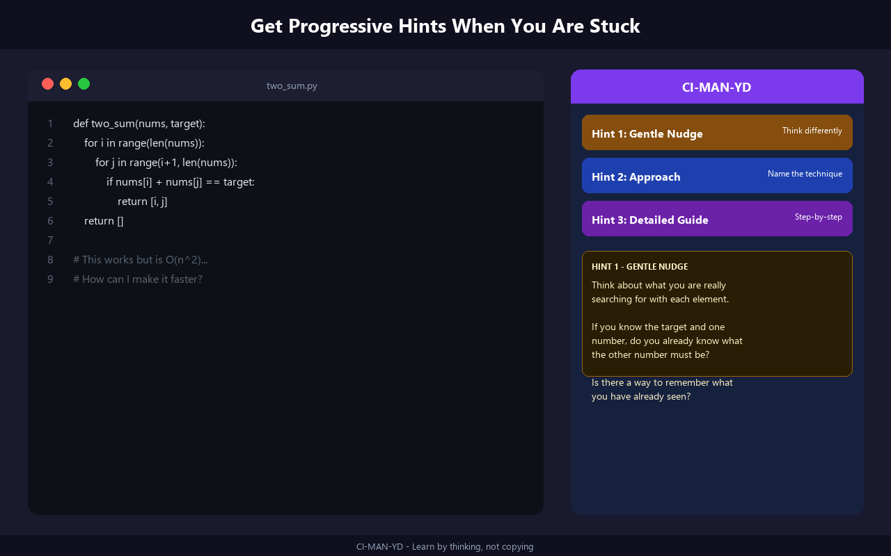
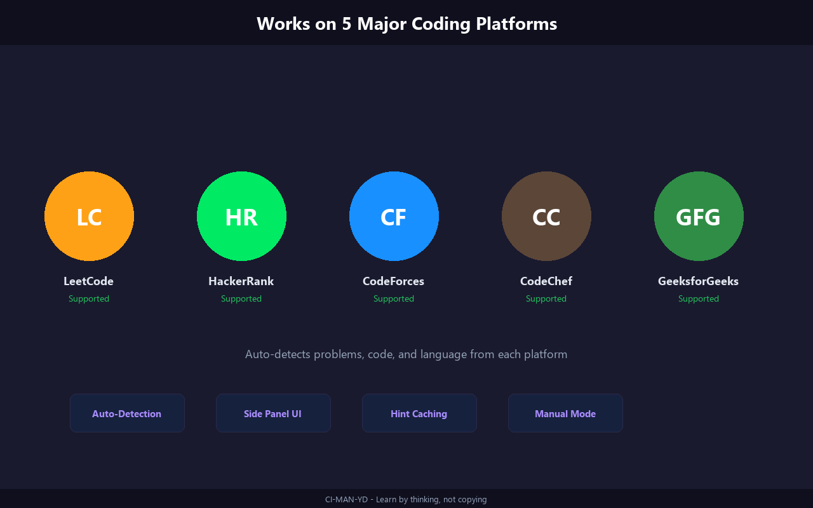
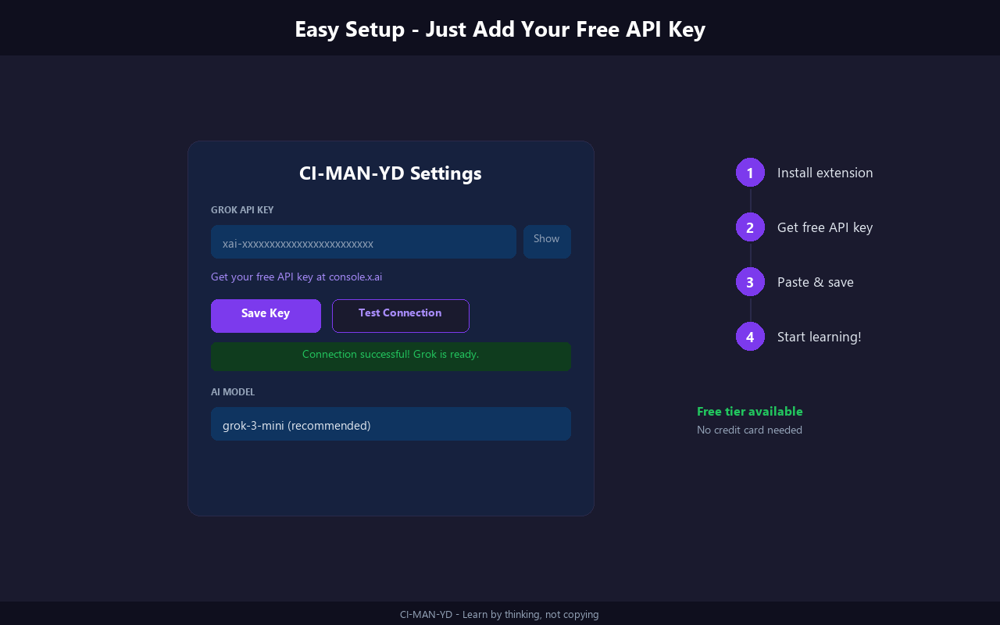

<p align="center">
  
</p>

<h1 align="center">HintCode</h1>
<p align="center"><strong>Smart Coding Hints for Students</strong></p>
<p align="center">
  A Chrome extension that gives progressive hints — not solutions — when you're stuck on coding problems.
</p>

<p align="center">
  
  
  
  
  
</p>

<p align="center">
  <a href="#install">Install</a> · <a href="#how-it-works">How It Works</a> · <a href="#features">Features</a> · <a href="#supported-platforms">Platforms</a> · <a href="CONTRIBUTING.md">Contribute</a>
</p>

---

<p align="center">
  
</p>

## The Problem

You're stuck on a LeetCode problem. You Google the answer, copy-paste, submit, move on. **You learned nothing.**

HintCode fixes this. Instead of giving you the answer, it **reads your code, finds the exact bug, and nudges you to fix it yourself.**

## How It Works

```
You're stuck on a coding problem
  → HintCode detects the problem + your code from the page
  → Click "Stuck? Get a Hint" (floating button)
  → Side panel opens

  → Hint 1: "Your line 4 resets m to 0. What happens when all numbers are negative?"
  → Hint 2: "This is a Kadane's algorithm problem. Your reset logic loses the least-negative answer."
  → Hint 3: Step-by-step fix guide pointing at each buggy line
  → Last resort: Full solution with inline comments on what was wrong
```

**Every hint references YOUR code. Not generic advice.**

<p align="center">
  
</p>

## Features

- **Code-Aware Hints** — Points at the exact line that's wrong, explains WHY with a failing test case
- **3 Progressive Levels** — Nudge → Approach → Detailed Guide (escalate only when needed)
- **5 Platforms** — LeetCode, HackerRank, CodeForces, CodeChef, GeeksforGeeks
- **Auto-Detection** — Reads problem statement + your code directly from the page
- **Side Panel UI** — Stays open while you code, doesn't block anything
- **Manual Mode** — Paste any problem when auto-detection doesn't work
- **Hint Caching** — Navigate away and back without losing your hints
- **Multi-Provider** — Groq (free, no card) or Grok/xAI
- **Privacy First** — No servers, no tracking. Your code goes directly to the AI using YOUR key

## Install

<p align="center">
  
</p>

1. Clone this repo or [download ZIP](../../archive/refs/heads/main.zip)
2. Open `chrome://extensions/` in Chrome
3. Enable **Developer mode** (top right)
4. Click **Load unpacked** → select this folder
5. Click the extension icon → **Settings**
6. Select **Groq** (free, no card needed) → get key at [console.groq.com/keys](https://console.groq.com/keys)
7. Paste key → **Save** → **Test Connection**
8. Go to any LeetCode problem → click **"Stuck? Get a Hint"**

## Supported Platforms

| Platform | Auto-Detect | Code Extraction |
|----------|:-----------:|:---------------:|
| LeetCode | Yes | Monaco editor |
| HackerRank | Yes | CodeMirror / Monaco |
| CodeForces | Yes | ACE / textarea |
| CodeChef | Yes | Monaco |
| GeeksforGeeks | Yes | CodeMirror / Monaco |

Want to add a platform? It's one file with 5 functions. See [CONTRIBUTING.md](CONTRIBUTING.md).

## Privacy

- **No backend server** — API calls go directly from the extension to the AI provider
- **No data collection** — zero analytics, zero telemetry, zero tracking
- **BYOK** — you provide your own API key, stored in Chrome's encrypted sync storage
- **Open source** — audit every line of code yourself

See [PRIVACY.md](PRIVACY.md) for details.

## Tech Stack

- Vanilla JavaScript — no build step, no framework, MV3 CSP compliant
- Chrome Extension Manifest V3
- Groq API / Grok API (OpenAI-compatible)

## Star History

If HintCode helped you learn, consider giving it a star! It helps other students find it.

## Contributing

Contributions welcome! See [CONTRIBUTING.md](CONTRIBUTING.md).

## License

[MIT](LICENSE)

---

<p align="center"><em>Built with the belief that struggling is where learning happens.</em></p>
